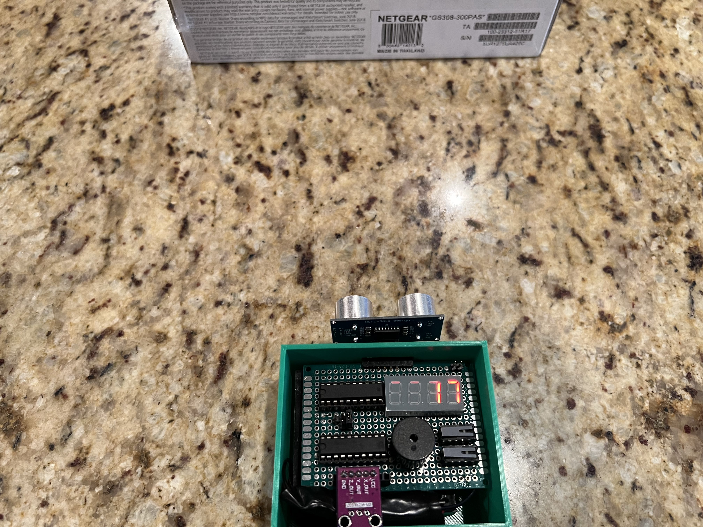
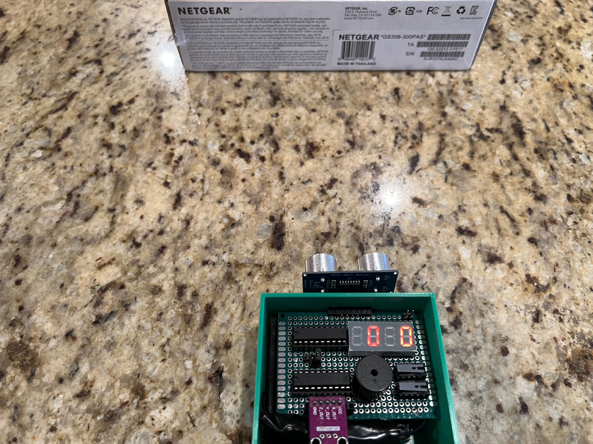
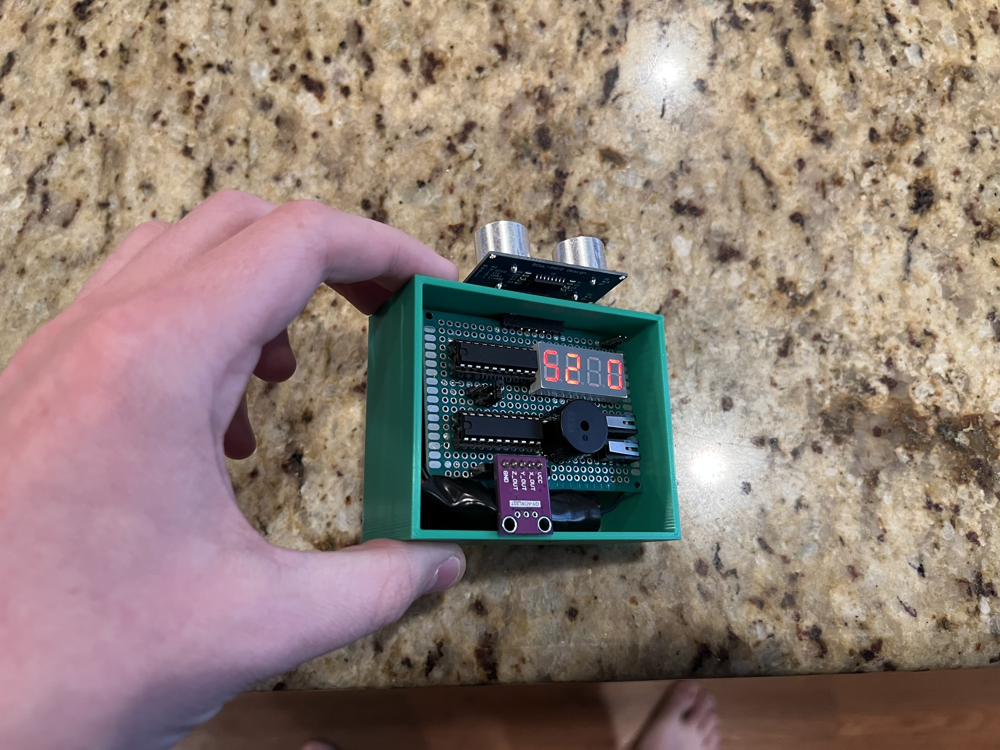

# Lab 09

## Description:
- Measures distance to an object and how level an object is between 0 and 90 degrees. A button is used to toggle between the two modes. A second button is used to toggle the distance at which the speaker buzzes and at which frequency it buzzes. The input data from the sensors is sent over UART to a second MSP430 to be displayed. The design was layed out on a perfboard and a battery pack with a voltage regulator was used as the input voltage.
- Needs to be single file
    - Read a dedicated GPIO Pin to determine which MCU reads input from the sensors and buttons and which one displays the values.

## MSP430G2553 ADC Intput µ1 
- Reads input from ADC and sends the result to another MSP (µ2) for display.
    - Main System States:
        - ReadADC: 
            - Reads the x and y inputs from an accelerometer.
            - Handles potential oscillation between two adc values.
            - Scales the acceleromter's axis values to be between 0 and 90 degrees to measure how level the object is.
        - ReadUS: 
            - Reads the echo pin of the ultrasonic sensor and uses a timer to count the total time to the object.
            - Calculates the distance to the object in cm.
        - SendUART: 
            - Sends the 4 characters over UART.
            - ReadADC Mode:
                - Sends both x and y to be displayed. 
                - The first two chars are the y axis.
                - The second two chars are the x axis.
            - DisplayUS Mode:
                - Sends the calculated distance between 0 and 400 cm.

## MSP430G2553 Output µ2 
- Displays ADC Value on 4-7 segment displays recieved from another MSP (µ1).
    - States:
        - DisplayADC: 
            - Displays the recieved x and y scaled values from an accelerometer on a 4-7 segment display.
        - DisplayUS:
            - Displays the calulated distance value from an ultrasonic sensor on a 4-7 segment display.
        - RecieveUART:
            - Recieves the 4 characters to display on the 4-7 segment displays. 
            - Each display can display 0-9.

## Images:
### Distance Measurement to an object.

### Degree Measurement of x and y axis. Shows level on both axis.

### Degree Measurement of x and y axis. Shows level on only the y axis.

